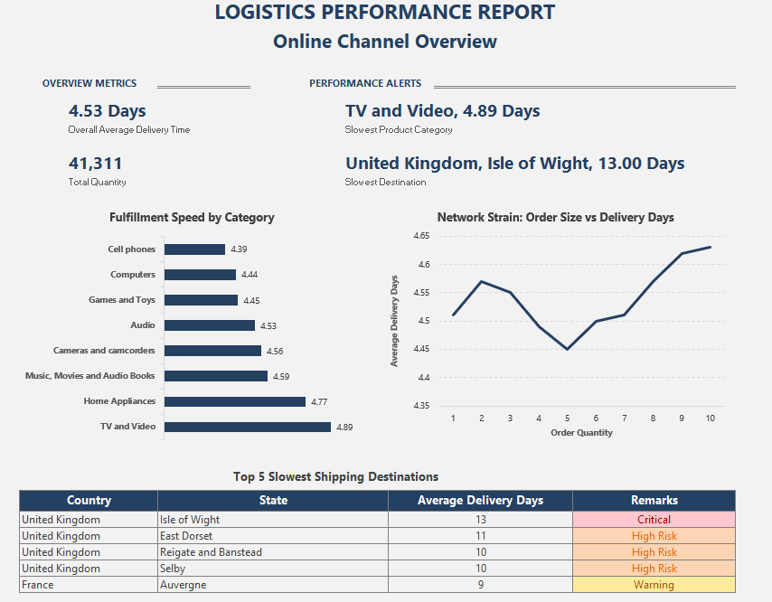

# 📊 Online Fulfillment Velocity & Logistics Bottleneck Analysis

## Project Summary
Analyzed global e-commerce supply chain data to evaluate order fulfillment speed, geographical bottlenecks, and network performance under varying order volumes. Filtered out physical retail store transactions from an initial 62,884 raw records to isolate 13,165 direct-to-consumer online orders. Leveraged PostgreSQL for database staging and data cleaning, Python (`Pandas`) for lead-time calculations and aggregation, and Microsoft Excel to deliver an executive-facing operational report.

---

## 💼 My Work
* Ingested multi-table relational data into PostgreSQL (pgAdmin 4) and cleaned raw text fields by casting data types and stripping currency formatting (`$` and `,`).
* Filtered out 49,719 brick-and-mortar transactions (`store_key != 0`) to focus exclusively on online direct-to-consumer logistics.
* Engineered a custom `delivery_lead_time` metric in Python (`Pandas`) calculating `delivery_date - order_date` to measure end-to-end turnaround times.
* Executed chronological validation checks to verify zero logical anomalies (such as delivery dates preceding order dates).
* Exported structured analytical summaries into a multi-tab workbook using `pd.ExcelWriter`, designing a clean executive dashboard with dynamic conditional formatting.

---

## 🎯 Business Problem
An international consumer electronics retailer lacked granular visibility into its direct-to-consumer fulfillment efficiency, making it difficult to pinpoint localized courier bottlenecks or assess operational resilience under bulk ordering.

**Leadership required operational insights on three core questions:**
1. Which product categories face the longest packaging and delivery turnaround times?
2. Which countries, states, or regions experience severe delivery infrastructure latency?
3. Does fulfillment speed degrade when processing larger bulk order quantities?

---

## ⚙️ Tools & Tech Stack
* **Database & SQL:** PostgreSQL (pgAdmin 4), SQL (`WHERE`, `CAST`, `REPLACE`, `JOINS`)
* **Data Processing & Analytics:** Python (`Pandas`, `Jupyter Notebook`)
* **Reporting & Presentation:** Microsoft Excel (`pd.ExcelWriter`, Conditional Formatting, Executive Layout Design)

---

## 📁 Dataset & Filtering Scope
* **Source:** Global Electronics Retailer Dataset (Maven Analytics)
* **Total Transactions:** 62,884 orders
* **Scope Boundary:** Filtered out 49,719 physical retail store sales (`store_key != 0`), yielding an active sample of **13,165 online transactions** (`store_key = 0`).
* **Key Dimensions:** Order Numbers, Order Dates, Delivery Dates, Order Quantities, Product Categories, Customer Countries, Customer States.
* **Dataset Limitation:** Lacks explicit `ship_date` timestamps; turnaround is evaluated strictly from order placement to final customer delivery (`delivery_date - order_date`).

---

## 📝 Data Validation & Cleaning

| Check / Process | Logic / Filter | Finding / Result | Action Taken |
| :--- | :--- | :--- | :--- |
| **Data Type Cleanup** | Strip `$`, `,` encoding errors from numerical fields | Raw text blocked numeric calculations | Sanitized input using SQL `REPLACE()` and `CAST()` |
| **Scope Separation** | Physical retail store sales (`store_key != 0`) | 49,719 offline rows present | Excluded via SQL `WHERE` clause to focus strictly on e-commerce |
| **Chronology Audit** | `delivery_date < order_date` | 0 anomalies found | Confirmed dataset chronological integrity |
| **Open Backlogs Audit** | `delivery_date IS NULL` | 0 open backlogs in online scope | Confirmed all online transactions in scope were completed |

---

## 📈Report Overview

## 💡 Key Insights

### 1. Baseline Fulfillment Velocity Across Categories
* The overall average delivery lead time across all online orders is **4.53 days** (covering 41,311 total items sold).
* Lead times remain relatively consistent across categories, ranging from **4.39 days** (Cell phones) to **4.89 days** (TV and Video).
* **TV and Video** represents the slowest category at **4.89 days**, likely driven by specialized freight handling and bulkier protective packaging requirements for oversized electronics.

### 2. Severe Geographic Delivery Lag (UK Concentration)
* **The United Kingdom is the primary delivery bottleneck**, representing 4 out of the 5 slowest global delivery destinations.
* **Isle of Wight (UK)** recorded the single longest delivery delay globally at **13.0 days** (*Critical* alert).
* Other high-risk delay zones include **East Dorset, UK** (11.0 days), **Reigate and Banstead, UK** (10.0 days), **Selby, UK** (10.0 days), and **Auvergne, France** (9.0 days).

### 3. Volume Resilience Under Strain
* The logistics network demonstrates strong operational resilience to order volume.
* Increasing order size from **1 unit (4.51 days)** to **10 units (4.63 days)** introduces an incremental delay of only **0.12 days (~2.9 hours)**.

---

## ✍🏻 Strategic Recommendations

1. **Audit UK Third-Party Logistics (3PL) Partners:**
   * Conduct an immediate performance audit on UK shipping vendors to resolve localized delivery drag affecting regional fulfillment times (10–13 days).

2. **Optimize Last-Mile Delivery for Island & Remote Territories:**
   * Establish dedicated satellite fulfillment nodes or partner with regional last-mile specialists to eliminate severe lag in island/coastal destinations like the Isle of Wight.

3. **Incentivize Bulk & Multi-Item Purchasing:**
   * Encourage multi-item consumer bundles through volume discounts. Because order size increases delivery times by less than 3 hours, bulk orders optimize freight costs per unit without degrading customer delivery SLAs.

---

## 🧠 Skills Demonstrated

* **Data Engineering & SQL:** PostgreSQL Staging, Data Sanitization, Type Casting, Multi-Table Relational Joins, Scope Filtering.
* **Python Data Analysis:** Pandas Wrangling, Datetime Feature Engineering (`delivery_lead_time`), Data Aggregation, Multi-Tab Excel Exporting (`pd.ExcelWriter`).
* **Supply Chain & Logistics Analytics:** Delivery Lead-Time Modeling, Geographic Latency Assessment, Freight Volume Stress Testing, Root Cause Analysis.
* **Dashboard Design & Reporting:** Executive Excel Reporting, Scannable Wireframing, Conditional Heatmap Alerts, Strategic Business Recommendations.

## 📬 Contact
If you have feedback, questions, or opportunities, feel free to connect with me:

- 🔗 LinkedIn: https://www.linkedin.com/in/jj-teston-b41950374/
- 📧 Email: johnjesterteston@gmail.com
  
⭐ I'm currently open to entry-level Data Analyst opportunities.

